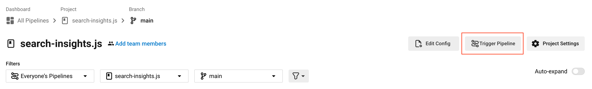
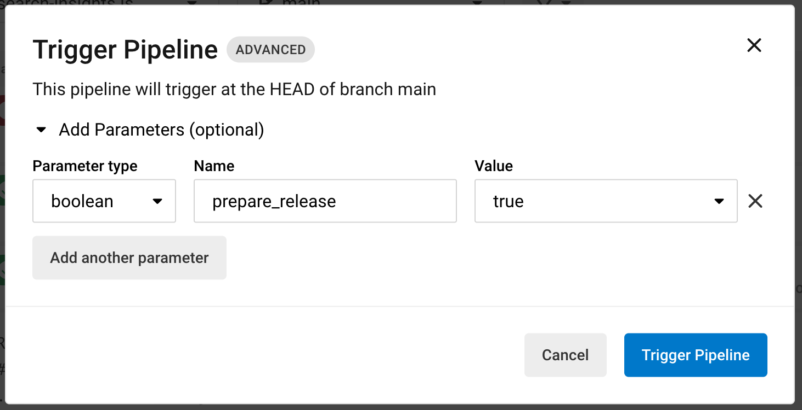

# Releasing search-insights.js

## Automatic

CircleCI automatically triggers a release workflow every Tuesday at 9am (UTC), which will create a pull request for the next release if there have been any changes since the last release (see [example](https://github.com/algolia/search-insights.js/pull/520)).

After the pull request is reviewed, approved and merged, CircleCI will automatically publish it to npm.

## Manual

There are two ways to manually trigger a release:
1. Via the command line
2. Via the CircleCI UI

### Command line

On the `main` branch (`git checkout main`) run:

```sh
yarn run release
```

This will create a pull request for the next release. After the pull request is reviewed, approved and merged, CircleCI will automatically publish it to npm.

### CircleCI

1. In the **search-insights.js** project on the **main** branch, click the **Trigger Pipeline** button



2. Add the boolean parameter `prepare_release` and set it to `true`



3. Click **Trigger Pipeline**

This will run the `prepare_release` workflow and create a release pull request if successful. After the pull request is reviewed, approved and merged, CircleCI will automatically publish it to npm.
